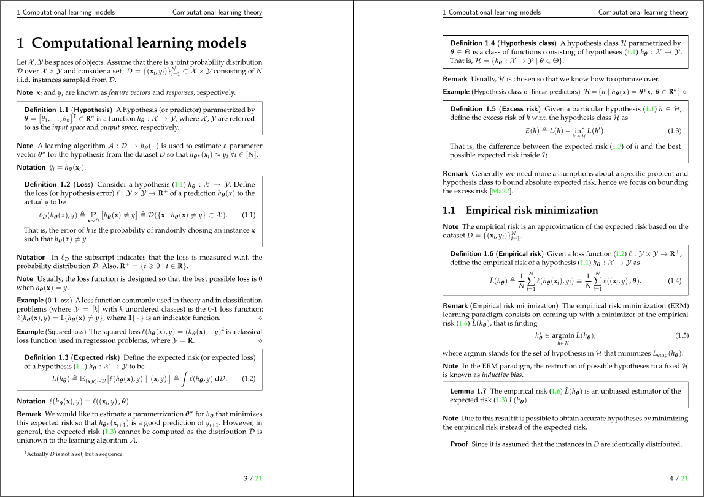

# Computer science and mathematics notes

A collection of personal notes for different (theoretical) computer science and mathematics 
related topics written using LaTeX. [Here](#list-of-covered-topics) is a list of covered topics 
in the notes.



> **Note** Some notes might be incomplete or may contain errors.

---

## Compiling the notes

The notes can be compiled running the provided [`compile.py`](scripts/compile.py) Python script in 
the [scripts](scripts) directory.

```bash
python3 scripts/compile.py [options] [notes]
```
where `notes` is the name of the folder of the notes to be compiled. If no folder is provided, all 
the notes  will be compiled by default (which may take a while).

The script supports compilation via a [Docker](https://www.docker.com/) image (meaning no LaTeX 
distribution needs to be installed locally) providing the `--docker` option. In this case, the Docker 
image needs to be built beforehand as `docker build -t cse-latex-docker`.

If not using Docker, a LaTeX distribution is required and some LaTeX dependencies in the 
[latex-stuff](latex-stuff) directory need to be setup. The later can be achieved running the 
[`install-latex-stuff.sh`](scripts/install-latex-stuff.sh) script, which is also included in the 
[scripts](scripts) folder.

Either way, the resulting files for the notes can be found in the corresponding folder for each topic.

---

## List of covered topics

The following is a list of the covered topics in these notes, each of them in their corresponding folder inside [notes](notes).

### [Algorithm analysis](notes/algorithm-analysis)

Introduction to the analysis of algorithms. Classical sorting (local, recursive, heap-based) and search methods (linear search, binary search trees, AVL trees,
hash maps).

### [Computational learning theory](notes/computational-learning-theory)

Learning models. The PAC framework and VC dimension. Linear models. Kernel methods. Dimensionality reduction. Boosting methods.

### [Probability theory and statistics](notes/probability-theory-statistics)

Measure theory and probability spaces. Discrete and continuous random variables. Inferential statistics: point estimation and confidence sets.
Parametric and nonparametric hypothesis testing.

---

## Notes structure

Each topic is contained within its own folder, which is structured as follows.

```
notes
├── ...
├── linear-algebra
│   ├── main.tex
│   ├── 01-vector-spaces.tex
│   ├── 02-linear-transformations.tex
│   ├── ...
│   ├── references.bib
│   └── figures
│       ├── linear-subspace.svg
│       ├── linear-subspace.pdf_tex
│       ├── linear-subspace.pdf
│       └── ...
├── ...
```

The topic is splitted into different subtopics whose `.tex` files are named with the format `xx-subtopic-name.tex`. Then `main.tex` bundles up all the 
subtopics in the folder into a single `.tex` file, which is compiled at some point. 

The `figures` folder contains all the images used in the notes, usually in `.svg` format or `.pdf`. Finally, `references.bib` contains all the books, notes 
or whatever is referenced somewhere in the notes, which is used to generate the *References* section in the document.

<!--
The `main.tex` and `references.bib` files, as well as the `figures` folder are generated when running the [`init-notes.py`](scripts/init-notes.py) Python script.
Subtopics should be manually added to `main.tex` using the `\input{xx-subtopic-name.tex}` LaTeX macro.-->

---

## Technical LaTeX stuff

To improve the note-taking experience with LaTeX, in the [latex-stuff](latex-stuff) folder there are included some custom document classes and packages ment
to ease writing notes and to keep them nice formatted. These include the [`exmath`](latex-stuff/exmath.sty) package for math-related macros and environments
along with the [`csenotes`](latex-stuff/csenotes.cls) and [`cselab`](latex-stuff/cselab.cls) document classes, each of them defined in their corresponding
`.sty` and `.cls` files.

<!--The documentation for the `csenotes` and `cselab` document classes, as well as the `exmath` package can be found in the [doc](doc) folder.-->

> **Note** If you are unfamiliar with the development of custom LaTeX packages and document classes, the 
[Overleaf documentation](https://es.overleaf.com/learn/latex/Understanding_packages_and_class_files) is a great place to start reading.

---

## Contributing

If you find any mistake, have some suggestion or you want to contribute to the project in any way don't hesitate to open a pull request.

## License
These notes are licensed under [Creative Commons Attribution - No Commercial - Share Alike 4.0](https://creativecommons.org/licenses/by-nc-sa/4.0/legalcode). They can be freely used and distributed as long as the original author is credited, they aren't used for commercial purposes and derived work is shared under this same license.

<center>

[![CC BY-SA 4.0][cc-by-sa-image]][cc-by-sa]

</center>

[cc-by-sa]: http://creativecommons.org/licenses/by-sa/4.0/
[cc-by-sa-image]: https://licensebuttons.net/l/by-sa/4.0/88x31.png
[cc-by-sa-shield]: https://img.shields.io/badge/License-CC%20BY--SA%204.0-lightgrey.svg

---

## References

- Castel G. (2019). *How I'm able to take notes in mathematics lectures using LaTeX and Vim*. [[Article]](https://castel.dev/post/lecture-notes-1/)
